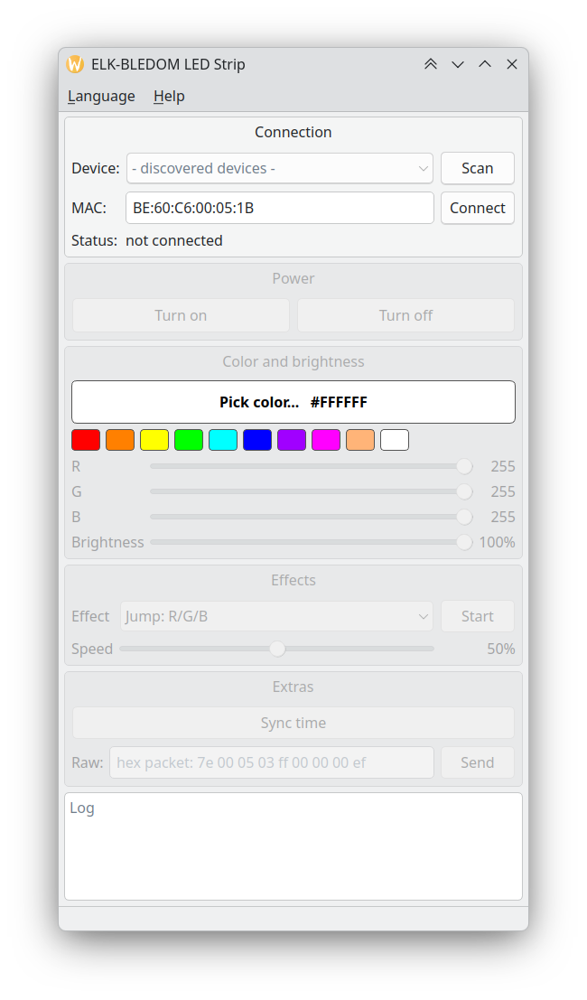

# bledom-qt

[Русская версия](README.ru.md)

A Qt 6 desktop application for controlling an **ELK-BLEDOM** LED strip controller over Bluetooth LE.



Features:

- Scan for BLE devices or connect by MAC address
- Power on/off, RGB color (color dialog with live preview, presets, sliders), brightness
- 22 built-in effects with speed control
- Time sync and a raw hex packet field for experiments
- Packet log of everything sent to the strip
- English / Russian UI, switchable at runtime from the **Language** menu
- CLI mode for scripts and hotkeys
- Remembers MAC, color, brightness and language between runs

## Build

Dependencies: Qt 6 (`Core`, `Gui`, `Widgets`, `Bluetooth`, `LinguistTools`), CMake ≥ 3.21, Ninja.

Arch / Manjaro:

```sh
sudo pacman -S qt6-base qt6-connectivity qt6-tools cmake ninja
```

```sh
cmake -S . -B build -G Ninja -DCMAKE_BUILD_TYPE=Release
cmake --build build
./build/bledom-qt
```

## Usage

**GUI:** press **Scan**, pick `ELK-BLEDOM` (or type the MAC address), press **Connect**.
Everything below the connection box becomes active once the device is ready.

**CLI:**

```sh
bledom-qt -c BE:60:C6:00:05:1B                                   # open the GUI already connected
bledom-qt -c BE:60:C6:00:05:1B --power on --color ff8800 --brightness 80 --quit
bledom-qt -c BE:60:C6:00:05:1B --power off --quit
```

`--quit` runs the given commands headlessly and exits (exit code 0 on success, 2 on timeout).

## Localization

The source language is English. Translations live in `i18n/bledom-qt_<lang>.ts`
and are compiled into the binary as Qt resources.

After changing or adding `tr()` strings:

```sh
cmake --build build --target update_translations   # refresh .ts files
# edit i18n/bledom-qt_ru.ts (Qt Linguist or any editor)
cmake --build build                                 # .qm files are rebuilt automatically
```

To add a language, append its code to `I18N_TRANSLATED_LANGUAGES` in `CMakeLists.txt`
and to `Language::available()` in `src/Language.cpp`.

## ELK-BLEDOM protocol

Service `0000fff0-…`, write characteristic `0000fff3-…` (write without response).
Every packet is 9 bytes: `7E 00 <cmd> <a> <b> <c> <d> 00 EF`.

| Command          | Packet                                          |
|------------------|-------------------------------------------------|
| Power on         | `7E 00 04 F0 00 01 FF 00 EF`                    |
| Power off        | `7E 00 04 00 00 00 FF 00 EF`                    |
| RGB color        | `7E 00 05 03 RR GG BB 00 EF`                    |
| Brightness 0–100 | `7E 00 01 NN 00 00 00 00 EF`                    |
| Effect           | `7E 00 03 EE 03 00 00 00 EF` (EE = 0x87…0x9C)   |
| Speed 0–100      | `7E 00 02 NN 00 00 00 00 EF`                    |
| Set time         | `7E 00 83 HH MM SS DD 00 EF` (DD = weekday 1–7) |

## Layout

- `src/BledomDevice.{h,cpp}` — BLE layer: scanning, connection, command queue (coalesces slider spam).
- `src/MainWindow.{h,cpp}` — QtWidgets GUI.
- `src/Language.{h,cpp}` — runtime language switching.
- `src/main.cpp` — command-line handling.
- `i18n/` — translation sources.

## Credits

- Author: **uriid1**
- Built together with **Claude** (Anthropic)
